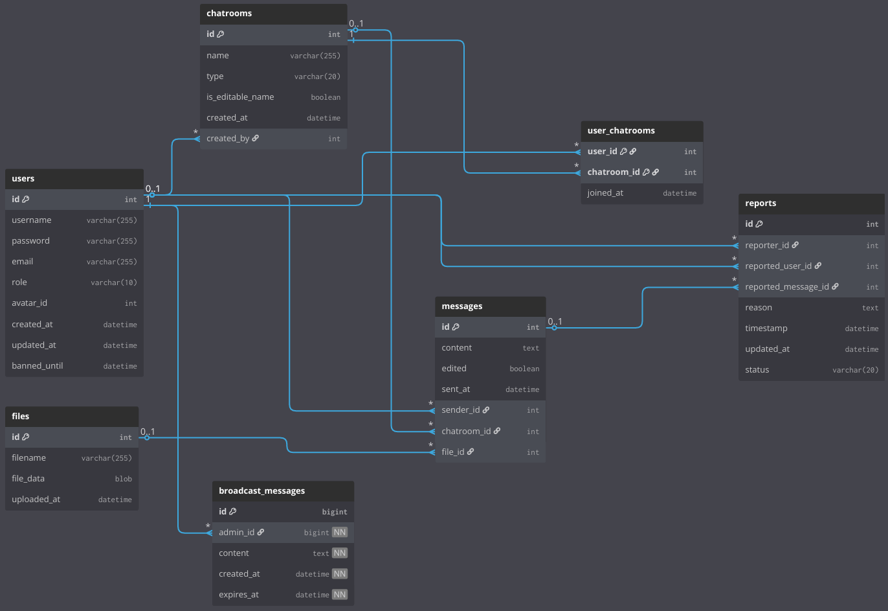

# WhatsApp Social Network – Spring MVC Project

## Overview

This project implements a full-stack **WhatsApp-like social network** using **Spring Boot MVC**, **JPA (MySQL)**, **Spring Security**, and **Thymeleaf**. It allows users to chat via private, group, or community chatrooms, send messages and files, report inappropriate content, and for administrators to moderate users and broadcast announcements.

Watch the full demo on [YouTube](https://www.youtube.com/watch?v=PLACEHOLDER)

---

## Screenshots

| Login Page        | Home Page             | Messaging Interface     |
| ----------------- | --------------------- | ----------------------- |
| [screenshot 1]    | [screenshot 2]        | [screenshot 3]          |
| Community Browser | Chatroom Management   | Message Report Page     |
| [screenshot 4]    | [screenshot 5]        | [screenshot 6]          |
| File Upload Flow  | Admin Report Panel    | Broadcast Creation Page |
| [screenshot 7]    | [screenshot 8]        | [screenshot 9]          |
| Banned Notice     | Admin Home Restricted | Polling Active Cards    |
| [screenshot 10]   | [screenshot 11]       | [screenshot 12]         |

---

## How to Run the Project

### 1. MySQL DB Setup with XAMPP (for Windows)

#### Installing XAMPP (Recommended)

1. Download XAMPP from [https://www.apachefriends.org/index.html](https://www.apachefriends.org/index.html)
2. During installation, **DESELECT TOMCAT** from the components list (it installs an outdated version that may conflict).
3. Complete installation and run XAMPP Control Panel.

#### Starting XAMPP

- Open the XAMPP Control Panel
- Click **Start** on both:
  - **Apache**
  - **MySQL**

The MySQL database server will now be accessible on `localhost:3306`.

### 2. Running the SQL Initialization File

- In the same directory as this README, there is a file named `ex4_init.sql`
- Open [phpMyAdmin](http://localhost/phpmyadmin)
- Create a new database named `ex4`
- Import the SQL file using the **Import** tab in phpMyAdmin

---

## Admin Accounts

Two admin users are included in the database via the `ex4_init.sql`. Initially, they are regular users.

**To promote them to admins:**

1. Run the application
2. Log in with each user once to ensure they exist in the database
3. Open phpMyAdmin → Database `ex4` → Table `users`
4. Manually change the value in the `role` column to `ADMIN` for the relevant users

**Admin usernames:**

- `admin1@example.com`
- `admin2@example.com`

### Screenshots (optional placeholders):

- [ ] phpMyAdmin showing the users table
- [ ] Role update from USER → ADMIN

---

## Feature Overview

### General Features (All Users)

- Google OAuth2 login
- Create and join:
  - Private chatrooms
  - Group chatrooms (editable name, member add/remove)
  - Community chatrooms (publicly discoverable)
- Real-time styled messaging interface
- File attachments per message
- Message reporting system (one report per user per message)
- Broadcast viewer for admin announcements

### Admin-only Features

- View and moderate reported messages
- Dismiss or act on reports (24h, 1w, permanent bans)
- View banned users with expiration logic
- Create, edit, and delete time-limited broadcast messages
- Restricted from messaging/chatroom access
- Polling-enabled admin dashboard for new reports

---

## Database Tables Diagram

## 

---

## Technical Highlights

- **Session Usage:**

  - Tracks login state
  - Stores recent chatrooms visited
  - Controls visibility and access to session-specific content

- **Authentication:**

  - Uses Spring Security with Google OAuth2
  - Role-based access control enforced in controllers and views

- **WebSocket:**

  - Used for **real-time messaging** between users inside chatrooms
  - Enables live updates without polling or refreshing the page

- **Polling:**
  - Used in:
    - Admin dashboard to check for new reports
    - Home page to update and expire broadcast messages in real time
